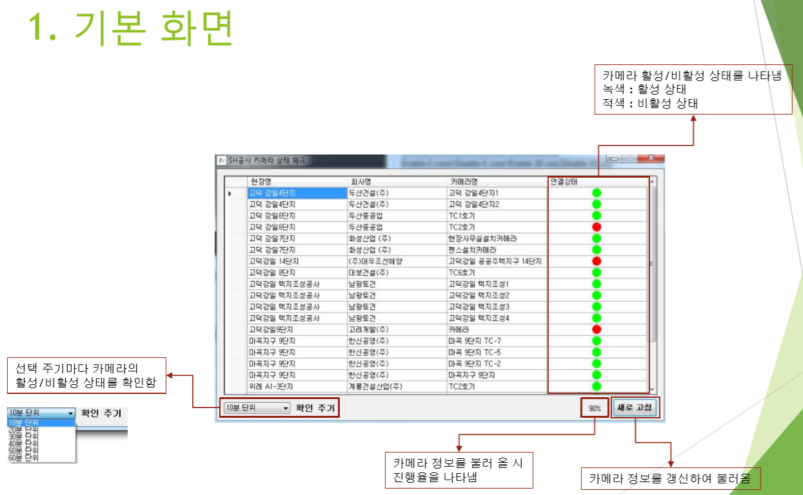
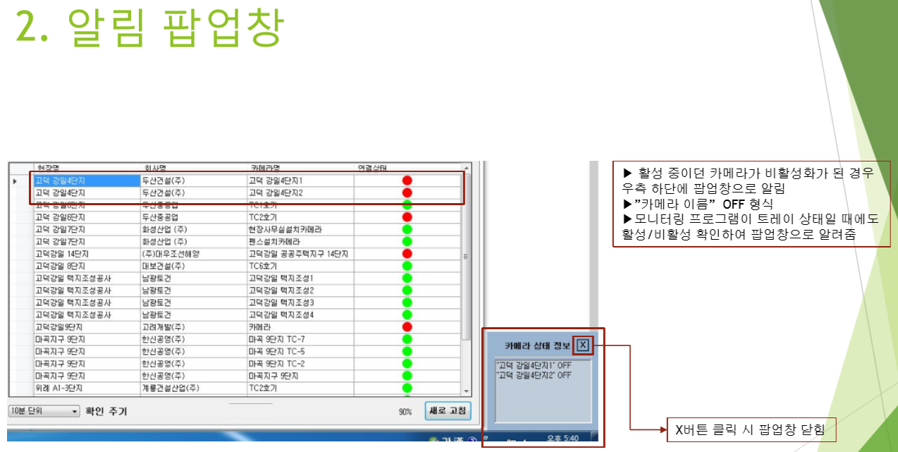
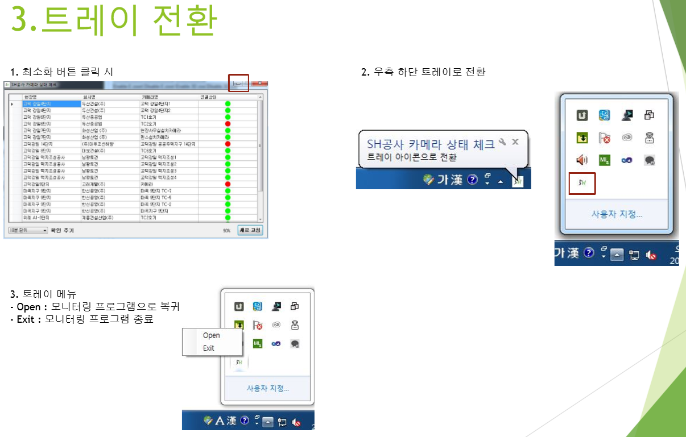

# 활성 카메라 모니터링 프로그램
## 프로젝트 소개
- HIKVISION API와 WinForm을 활용하여 모든 구현을 담당하였습니다. 현재 동작하고 있는 CCTV 카메라의 활성상태를 실시간으로 보기 위해 제작된 프로그램 입니다. 카메라가 작동 중인지 이상현상으로 연결이 끊어진 상태인지 확인할 수 있습니다.  PC에서 인스톨&언인스톨하여 사용할 수 있습니다.  

</img>  
</img>  
</img>  
